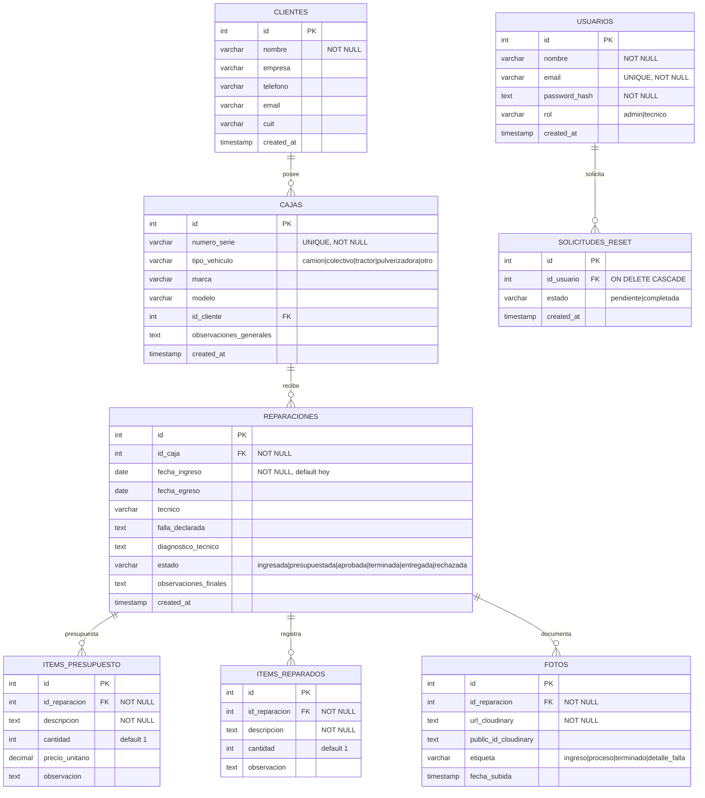
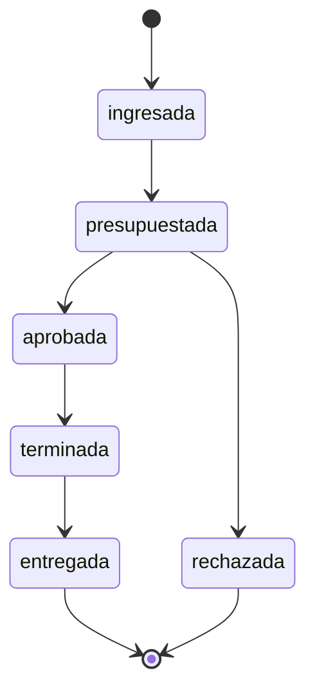

# Modelo de Dominio / DER — Cajas Automáticas

Diagrama entidad-relación del sistema de gestión de reparaciones de cajas automáticas. Derivado de [`server/schema.sql`](../server/schema.sql), que es la fuente de verdad del esquema (los modelos de Sequelize mapean estas tablas, no las generan).

---

## Diagrama



---

## Entidades

| Entidad | Rol en el dominio |
|---|---|
| **clientes** | Dueños de las cajas. Pueden ser particulares o empresas de transporte. |
| **cajas** | Caja automática física, identificada por su número de serie único. Pertenece a un cliente y puede pasar por varias reparaciones a lo largo del tiempo. |
| **reparaciones** | Orden de trabajo sobre una caja. Es la entidad central: tiene un ciclo de vida y agrupa presupuesto, trabajos y fotos. |
| **items_presupuesto** | Repuestos y mano de obra cotizados para una reparación. Alimentan el PDF del presupuesto. |
| **items_reparados** | Trabajos efectivamente realizados y repuestos usados, registrados una vez aprobado el presupuesto. |
| **fotos** | Registro fotográfico de la reparación, almacenado en Cloudinary. La etiqueta indica el momento de la toma. |
| **usuarios** | Operadores del sistema, con rol `admin` o `tecnico`. |
| **solicitudes_reset** | Pedidos de reseteo de contraseña, que un admin resuelve. |

---

## Cadena de dependencia

La consigna pide casos relacionados donde la información registrada por uno sirva de entrada para otro. En este modelo la cadena es:

```
cliente → caja → reparación → ítems de presupuesto → PDF del presupuesto
                            → ítems reparados
                            → fotos
```

Un cliente se da de alta, se le asocia una caja, sobre esa caja se abre una reparación, y sobre la reparación se cargan los ítems que alimentan el presupuesto en PDF. Cada nivel necesita que exista el anterior.

---

## Ciclo de vida de una reparación

El campo `reparaciones.estado` modela el flujo de trabajo del taller:



Este enum está replicado en `schema.sql`, en el esquema de Zod y el modelo de Sequelize del backend, y en los componentes `SelectorEstado` / `BadgeEstado` del frontend.

---

## Notas de implementación

- **`reparaciones.tecnico` es un campo de texto, no una clave foránea a `usuarios`.** Guarda el nombre del técnico responsable como dato histórico de la orden, de modo que el registro no cambia si después se modifica o elimina el usuario.
- **`cajas.id_cliente` admite `NULL`** a nivel de esquema, aunque la regla de negocio es que toda caja pertenece a un cliente; la aplicación siempre lo exige al dar de alta.
- **No hay `ON DELETE CASCADE` en la cadena principal.** Las bajas validan dependencias en la capa de aplicación: no se puede eliminar un cliente con cajas, ni una caja con reparaciones, y al borrar una reparación se eliminan primero sus hijos. La única excepción es `solicitudes_reset`, que sí cascadea al borrar el usuario.
- **Extensión `unaccent`**: habilitada para que la búsqueda de clientes ignore tildes.
